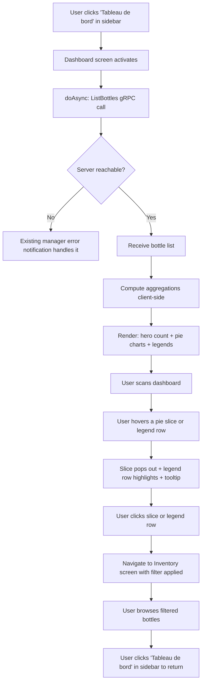
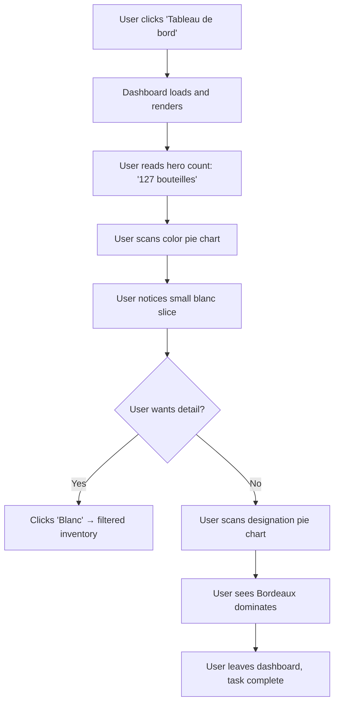
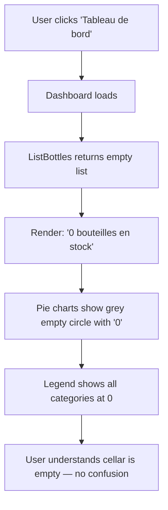

---
stepsCompleted:
  - step-01-init
  - step-02-discovery
  - step-03-core-experience
  - step-04-emotional-response
  - step-05-inspiration
  - step-06-design-system
  - step-07-defining-experience
  - step-08-visual-foundation
  - step-09-design-directions
  - step-10-user-journeys
  - step-11-component-strategy
  - step-12-ux-patterns
  - step-13-responsive-accessibility
  - step-14-complete
inputDocuments:
  - _bmad-output/planning-artifacts/prd.md
  - docs/index.md
  - docs/project-overview.md
  - docs/architecture.md
  - docs/data-models.md
  - docs/api-contracts.md
  - docs/development-guide.md
  - docs/source-tree-analysis.md
---

# UX Design Specification — winetap Dashboard

**Author:** Psy
**Date:** 2026-03-30

---

## Executive Summary

### Project Vision

New dashboard screen ("Tableau de bord") in the winetap Qt6 manager application. Surfaces actionable inventory insights — stock count, color breakdown, designation breakdown — from existing `ListBottles` gRPC data. Interactive drill-down navigates to filtered Inventory screen. First non-CRUD, read-only summary screen in the manager.

### Target Users

Single user — wine enthusiast managing a personal cellar of hundreds of bottles. Tech-savvy. Uses the manager on Linux or Windows desktop. All UI in French.

### Key Design Challenges

- **New screen type** — first non-CRUD, non-form screen in the manager. Requires a widget/card layout rather than the existing table+panel pattern.
- **Breakdown display** — presenting color and designation distributions effectively with Qt6 widgets while keeping them clickable for drill-down navigation.
- **UI consistency** — must feel native alongside existing inventory/catalogue screens despite being a fundamentally different screen type.

### Design Opportunities

- **Landing screen** — dashboard could become the default screen on launch, providing immediate cellar context.
- **Visual differentiation** — read-only informational layout can use more spacious, glanceable design that contrasts with denser CRUD screens.

## Core User Experience

### Defining Experience

The dashboard's core interaction is **passive consumption** — the user opens the screen and information is presented immediately with no input required. This fundamentally differs from every other manager screen (which requires selecting, searching, or filling forms). The secondary interaction is **exploratory drill-down** — clicking any data segment to jump to a filtered inventory view.

### Platform Strategy

- Desktop Qt6 application via miqt bindings (Linux + Windows)
- Mouse/keyboard interaction — no touch considerations
- Always-online: server connection required (existing manager error handling applies)
- No offline mode or data caching needed

### Effortless Interactions

- **Zero-click overview** — all summary data visible immediately on screen open, no scrolling to see key numbers
- **One-click drill-down** — any clickable element navigates directly to filtered inventory
- **Automatic refresh** — data fetched fresh every time the screen is opened, no manual refresh button needed

### Critical Success Moments

- **"Aha" moment** — user opens dashboard and instantly knows what they have (stock count, color split, top designations)
- **Decision moment** — user spots a data point of interest (e.g., only 3 blancs left) and clicks through to act on it
- **Empty cellar clarity** — even with zero bottles, the screen communicates the state clearly rather than looking broken

### Experience Principles

1. **Glanceable** — all key information visible without interaction or scrolling
2. **Actionable** — every data point is a gateway to the relevant inventory subset
3. **Honest** — empty states and zero counts are displayed clearly, never hidden
4. **Native** — fits the existing sidebar navigation and French UI language seamlessly

## Desired Emotional Response

### Primary Emotional Goals

- **Informed confidence** — "I know exactly what's in my cellar" without effort
- **Quiet satisfaction** — seeing a well-curated collection summarized cleanly

### Emotional Journey Mapping

| Moment | Desired Feeling |
|---|---|
| Opening the dashboard | Clarity — instant comprehension, no cognitive load |
| Scanning the breakdowns | Curiosity — "interesting, I didn't realize..." |
| Clicking a segment | Control — seamless transition to actionable detail |
| Empty cellar state | Neutral honesty — clear, not discouraging |

### Micro-Emotions

- **Confidence over confusion** — numbers and labels must be unambiguous at a glance
- **Satisfaction over frustration** — drill-down must be instant, never a dead end
- **Trust over skepticism** — data must visibly match what's in the inventory (fresh on every open)

### Design Implications

- Clean, spacious layout → clarity and calm (no visual clutter)
- Large, readable numbers for stock count → immediate confidence
- Obvious clickable affordances on breakdown items → control, no guessing
- French labels matching existing screens → familiarity, no disorientation

### Emotional Design Principles

1. **Clarity first** — if the user has to think about what a number means, the design failed
2. **No dead ends** — every interaction leads somewhere useful
3. **Consistent tone** — same visual language as the rest of the manager app

## UX Pattern Analysis & Inspiration

### Inspiring Products Analysis

**Grafana dashboards** — the primary inspiration. Key UX qualities to emulate:
- **Visualization quality** — clean, precise rendering with clear labels and data density
- **Mouse interactions** — rich hover states that reveal detail (tooltips, highlight effects) and obvious click affordances
- **Color palette** — muted, professional palette with good contrast. Uses color purposefully (to distinguish categories, not for decoration)
- **Panel layout** — widget grid where each panel is self-contained with a clear title, value, and visual

**KDE/GNOME System Monitor** — secondary reference for desktop-native dashboard feel. Card-based layout, "open and see" model.

**Wine apps (Vivino, CellarTracker)** — domain reference for information architecture: total bottles, distribution by type/region. Web/mobile patterns that translate to desktop.

### Transferable UX Patterns

**Layout:**
- **Grafana-style panel grid** — each widget gets its own bordered panel with title header. Clean separation between metrics.
- **Hero number + detail** — stock count as large prominent number at top, breakdowns below in their own panels.

**Interaction (Grafana-inspired):**
- **Rich hover states** — hovering a breakdown item highlights it visually (background color shift, slight emphasis) and can show additional detail
- **Click affordance** — cursor change + visual feedback on hover makes clickability obvious without needing explicit buttons
- **Panel hover** — subtle border or shadow change when hovering over a panel, signaling interactivity

**Visual (Grafana-inspired):**
- **Count + percentage** — dual display for breakdowns (e.g., "Rouge — 85 (67%)")
- **Grafana color approach** — muted professional palette, each wine color category gets a distinct but harmonious color. Use color to encode meaning (rouge = warm red, blanc = light gold, rosé = pink, effervescent = light blue, autre = grey)
- **Clean typography** — large numbers, smaller labels, consistent weight hierarchy

### Anti-Patterns to Avoid

- **Pie/donut charts** — miqt doesn't wrap QtCharts; custom chart rendering adds complexity for MVP. Revisit in post-MVP if desired.
- **Scrollable dashboard** — breaks the "glanceable" principle. Keep everything above the fold.
- **Dense data tables** — the Inventory screen already does this. Dashboard should feel visually distinct.
- **Flat, lifeless panels** — Grafana works because panels feel interactive and alive. Avoid static, unresponsive-looking widgets.

### Design Inspiration Strategy

**Adopt:**
- Grafana's panel grid with titled, bordered widgets
- Grafana's hover interaction model (highlight + cursor change + visual feedback)
- Grafana's muted professional color palette as baseline
- Semantic color mapping for wine categories

**Adapt:**
- Grafana's complex visualization → simpler labeled lists/bars for MVP, matching Qt6 widget capabilities
- Grafana's panel density → 3 panels for MVP (stock count, color, designation), spacious layout

**Avoid:**
- Custom chart rendering for MVP
- Scrollable layouts
- Static, interaction-free presentation

## Design System Foundation

### Design System Choice

**Existing Qt6 stylesheet** — the manager already has a CSS stylesheet embedded in `assets.go` that styles all widgets. The dashboard will use the same stylesheet foundation, extended with dashboard-specific styles for panels, hover states, and semantic wine colors.

### Rationale for Selection

- No choice to make — the manager's visual identity is already defined by its Qt stylesheet
- Adding a foreign design system would break visual consistency with existing screens
- Qt6 stylesheets support the Grafana-inspired effects we need: background colors, borders, hover pseudo-states, padding, font sizing
- Single developer, single codebase — extending the existing stylesheet is the simplest path

### Implementation Approach

- Extend the existing Qt stylesheet with dashboard-specific selectors
- Use `QFrame` or `QGroupBox` for Grafana-style panels (bordered containers with title headers)
- Use `QLabel` for hero numbers and panel titles (styled via font-size, font-weight)
- Use `QListWidget` or custom `QWidget` rows for breakdown lists with hover highlighting
- Apply Qt `setCursor(Qt::PointingHandCursor)` for click affordance on interactive elements

### Customization Strategy

**Dashboard color tokens (Grafana-inspired, wine-semantic):**

| Token | Color | Usage |
|---|---|---|
| Panel background | `#1e1e2e` or match existing app bg | Widget container fill |
| Panel border | `#3e3e5e` | Subtle panel outline |
| Panel hover border | `#5e5e8e` | Hover feedback on panels |
| Rouge | `#c0392b` | Red wine category |
| Blanc | `#f1c40f` | White wine category |
| Rosé | `#e8a0bf` | Rosé category |
| Effervescent | `#5dade2` | Sparkling category |
| Autre | `#95a5a6` | Other category |
| Row hover | `rgba(255,255,255,0.08)` | List item hover highlight |

**Note:** Exact colors will be confirmed against the existing stylesheet to ensure harmony. Dark/light theme depends on the current app theme.

## Defining Experience

### The Core Interaction

**"Open and know."** The dashboard's defining experience is: click "Tableau de bord" in the sidebar → instantly see your cellar summarized. No loading spinners, no configuration, no choices to make. Information appears, comprehension follows.

If a user describes this to a friend: *"J'ouvre le tableau de bord et je vois tout de suite ce que j'ai en cave."*

### User Mental Model

The user's mental model is a **wall-mounted summary board** — like a whiteboard in a wine shop showing today's stock. You glance at it, you know what's there. The dashboard is the digital equivalent mounted inside the app.

No existing solution in the current manager provides this — the Inventory screen requires browsing rows. The dashboard replaces the mental act of "let me scroll through and count" with instant aggregation.

### Success Criteria

- User comprehends stock state within 3 seconds of screen open
- Breakdowns are self-explanatory — no legend lookup, no ambiguous labels
- Clicking any item navigates to relevant inventory without any intermediate step
- Returning to dashboard from inventory drill-down restores the full summary (back = dashboard)

### Pattern Analysis

**Entirely established patterns** — no novel interaction design needed:
- Sidebar navigation → existing manager pattern
- Card/panel grid → standard dashboard pattern (Grafana)
- Clickable list with hover → established desktop UI pattern
- Hero number → universal dashboard pattern

No user education required. The dashboard should be immediately comprehensible on first open.

### Experience Mechanics

**1. Initiation:**
- User clicks "Tableau de bord" in the sidebar (same as any other screen)
- Dashboard screen activates, triggers `ListBottles` gRPC call via `doAsync()`

**2. Interaction:**
- Data loads → widgets populate with stock count, color breakdown, designation breakdown
- User scans the panels passively (zero-click overview)
- User hovers a breakdown row → row highlights (background color shift, cursor changes to pointer)
- User clicks a breakdown row → navigates to Inventory screen with filter applied

**3. Feedback:**
- Panels appear with data (confirmation that server is reachable and data is fresh)
- Hover highlight confirms interactivity before clicking
- Smooth navigation to filtered inventory confirms the drill-down worked

**4. Completion:**
- User either got the information they needed (glance and leave) or drilled down to Inventory
- No explicit "done" state — the dashboard is always ready, always current on each visit

## Visual Design Foundation

### Color System

**Existing app palette (from stylesheet.css):**

| Role | Color | Usage |
|---|---|---|
| Sidebar background | `#2c3e50` | Dark blue-grey |
| Sidebar hover | `#34495e` | Lighter blue-grey |
| Sidebar active | `#1abc9c` | Teal accent |
| Sidebar section text | `#95a5a6` | Muted grey |
| Text primary | `#2c3e50` | Form titles, labels |
| Success/Add | `#27ae60` | Green buttons |
| Danger/Delete | `#e74c3c` | Red buttons |
| Warning | `#8e44ad` | Purple buttons |
| Search | `#3498db` | Blue buttons |
| Copy | `#f39c12` | Orange buttons |
| Disabled | `#95a5a6` bg, `#d5d8dc` text | Greyed out |
| Borders | `#bdc3c7` | Inline boxes |
| Separators | `#dee2e6` | Frame lines |

**Dashboard-specific color additions (wine-semantic, Grafana-inspired):**

| Token | Color | Rationale |
|---|---|---|
| Rouge | `#c0392b` | Consistent with existing `#e74c3c` danger tone but deeper — reads as "red wine" |
| Blanc | `#f1c40f` | Gold/amber — conveys white wine without clashing with existing palette |
| Rosé | `#e8a0bf` | Soft pink — distinct from rouge |
| Effervescent | `#3498db` | Matches existing search/blue — reads as sparkling/fresh |
| Autre | `#95a5a6` | Matches existing disabled/muted grey — reads as "other" |
| Panel background | `#ecf0f1` | Light grey — subtle contrast against white content area |
| Panel border | `#bdc3c7` | Matches existing `inline-box` border |
| Panel hover border | `#2c3e50` | Darkens to match sidebar primary — signals interactivity |
| Row hover | `#d5dbdb` | Subtle highlight on light background |

### Typography System

**Existing type scale (from stylesheet.css):**

| Role | Size | Weight | Usage |
|---|---|---|---|
| Screen title | 18px | Bold | `QLabel[role="screen-title"]` — "Tableau de bord" |
| Section header | inherit | Bold | `QLabel[role="section-header"]` — panel titles |
| Form title | 14px | Bold | `QLabel[role="form-title"]` |
| Body | System default (~13px) | Normal | Sidebar items, general text |

**Dashboard additions:**

| Role | Size | Weight | Usage |
|---|---|---|---|
| Hero number | 36px | Bold | Stock count — large, prominent |
| Hero label | 14px | Normal | "bouteilles en stock" beneath hero number |
| Breakdown count | 14px | Bold | Number in each breakdown row |
| Breakdown percentage | 12px | Normal | Percentage in parentheses |
| Panel title | 14px | Bold | Reuse `section-header` role |

### Spacing & Layout Foundation

**Base unit:** 8px (consistent with existing stylesheet: `padding: 8px 16px`, `margin-bottom: 8px`)

**Dashboard layout:**
- Top row: hero stock count panel (full width)
- Bottom row: 2-column layout — color breakdown (left), designation breakdown (right)
- Panel padding: 16px internal
- Panel gap: 16px between panels
- Panel border-radius: 4px (matches existing `inline-box`)

**Content area:** Dashboard occupies the full right panel (same area as Inventory, Add Bottles, etc.)

### Accessibility Considerations

- All text colors maintain minimum 4.5:1 contrast ratio against their backgrounds
- Wine category colors are paired with text labels — color is never the only differentiator
- Hover states provide visual change beyond just color (border emphasis)
- Clickable elements use cursor change as additional affordance
- Font sizes at or above 12px for all dashboard text

## Design Direction Decision

### Chosen Direction

**Direction B — Hero + 2-Column Grid with custom QPainter pie charts**

Layout: full-width hero stock count panel on top, two equal-width breakdown panels below side by side. Each breakdown panel contains a pie chart visualization above a labeled legend list.

### Design Rationale

- Hero number dominates — immediate stock comprehension
- Side-by-side breakdowns keep everything above the fold
- Pie charts add Grafana-quality visualization while legend provides exact numbers
- Legend + chart pairing ensures color is never the sole differentiator (accessibility)
- Custom QPainter stays native Qt, no external dependencies, full control over interaction

### Pie Chart Interaction Design (Grafana-inspired)

**Hover behavior:**
- Hovering a pie slice → slice visually "pops out" (slight radial offset, 4-6px) + tooltip showing label, count, and percentage
- Hovering a legend row → corresponding slice highlights (brighter fill or outline emphasis) + row background changes
- Bidirectional: hovering either the slice or the legend row highlights both

**Click behavior:**
- Clicking a slice or its legend row → navigates to Inventory screen filtered to that category
- Cursor changes to pointer on hover over interactive elements

**Empty state:**
- Zero bottles → pie chart area shows a single grey circle with "0" centered, legend shows all categories at 0

### Implementation Approach

**Custom PieChartWidget (QWidget subclass):**
- Override `paintEvent()` using `QPainter` to draw filled arc segments
- Use `QPainter.SetRenderHint(QPainter__Antialiasing)` for smooth edges
- Track mouse position via `mouseMoveEvent()` for hover detection (hit-test against arc angles)
- Emit signal on click with the category identifier
- Accept data as slice array: `[]PieSlice{Label, Count, Color}`

**Panel structure:**
- Each breakdown panel = `QFrame` with vertical layout: panel title (QLabel) → pie chart widget → legend list
- Legend rows = horizontal layout: color swatch (small QFrame with background) + label + count + percentage
- Legend rows are clickable (same navigation as slice click)

**Designation panel consideration:**
- Designation list may have many entries (10+ appellations)
- Pie chart shows top N slices (e.g., top 8) with remaining grouped as "Autres"
- Legend scrolls if needed, but pie chart stays fixed size

## User Journey Flows

### Journey 1 — Quick Cellar Check (Drill-Down)

### Journey 2 — Collection Exploration (Browse Only)

### Journey 3 — Empty Cellar

### Journey Patterns

**Navigation pattern:** Sidebar click → screen activate → async data fetch → render. Same pattern as all other manager screens. Dashboard adds no new navigation concepts.

**Drill-down pattern:** Hover (visual feedback) → click (navigate with filter) → sidebar return. This is a new pattern for the manager — other screens don't have click-to-navigate-with-filter. The Inventory screen will need to accept an initial filter parameter.

**Feedback pattern:** Data appears on load (no loading spinner needed for <1s renders). Hover states provide continuous feedback. Empty states display explicitly rather than hiding widgets.

### Flow Optimization Principles

- **Zero-step entry** — dashboard renders immediately on sidebar click, no configuration or selection needed
- **One interaction to value** — any single click on a breakdown leads directly to filtered inventory
- **No dead states** — empty cellar shows meaningful "0" state, never a blank screen
- **Bidirectional hover** — slice and legend are always in sync, reducing confusion about what's clickable
- **Stateless screen** — dashboard has no state to manage; every visit fetches fresh data and computes fresh aggregations

### Cross-Screen Integration

The Inventory screen needs to accept a filter parameter so the dashboard can navigate to it with a pre-applied filter (e.g., color=blanc or designation=Bordeaux). This is a new cross-screen integration point not currently present in the manager.

## Component Strategy

### Design System Components (Available from Qt6/miqt)

| Component | Qt Widget | Dashboard Usage |
|---|---|---|
| Screen container | `QWidget` | Dashboard screen root |
| Panel/card | `QFrame` with stylesheet | Bordered widget containers |
| Title label | `QLabel[role="screen-title"]` | "Tableau de bord" |
| Section header | `QLabel[role="section-header"]` | Panel titles |
| Layout managers | `QVBoxLayout`, `QHBoxLayout`, `QGridLayout` | Panel arrangement |
| Sidebar entry | `QPushButton[role="sidebar-item"]` | "Tableau de bord" nav button |

### Custom Components

#### PieChartWidget

**Purpose:** Renders an interactive pie chart from categorical data with Grafana-quality visuals.
**Content:** Array of slices, each with label, count, and color.
**Anatomy:**
- Circular pie area (filled arc segments drawn via QPainter)
- Optional center label (total count or empty state "0")
**States:**
- *Default* — all slices rendered at normal size
- *Hover slice* — hovered slice pops out (4-6px radial offset), tooltip appears with label/count/percentage
- *Empty* — single grey circle with "0" centered
**Interaction:** `mouseMoveEvent` hit-tests angle to detect hovered slice. `mousePressEvent` emits clicked signal with slice identifier. Cursor set to `PointingHandCursor` when over a slice.
**Signals:** `sliceClicked(identifier string)`, `sliceHovered(identifier string)`, `sliceUnhovered()`

#### LegendWidget

**Purpose:** Displays a labeled list of categories that syncs with a PieChartWidget for bidirectional hover.
**Content:** Array of legend entries matching pie slices.
**Anatomy per row:**
- Color swatch (small `QFrame`, 12x12px, with background-color)
- Label text (`QLabel`)
- Count (`QLabel`, bold)
- Percentage (`QLabel`, smaller, muted)
**States:**
- *Default* — normal row styling
- *Hover* — row background highlights (`#d5dbdb`), cursor changes to pointer
- *Synced hover* — when corresponding pie slice is hovered externally, row highlights automatically
**Interaction:** Click emits same navigation signal as pie slice click. Hover emits signal to sync with PieChartWidget.
**Signals:** `rowClicked(identifier string)`, `rowHovered(identifier string)`, `rowUnhovered()`

#### HeroCountWidget

**Purpose:** Displays a single large number with a subtitle label.
**Content:** Count value (int) + label text (string).
**Anatomy:**
- Large number (`QLabel`, 36px bold, centered)
- Subtitle label (`QLabel`, 14px normal, centered, e.g., "bouteilles en stock")
**States:**
- *Default* — displays count
- *Zero* — displays "0" (same styling, no special treatment)
**Interaction:** None — display only, not clickable.

#### DashboardPanel

**Purpose:** Grafana-style bordered container wrapping any content widget with a title header.
**Content:** Title string + child widget.
**Anatomy:**
- Title bar (`QLabel[role="section-header"]`, top of panel)
- Content area (child widget fills remaining space)
- Border: 1px `#bdc3c7`, border-radius 4px, padding 16px
**States:**
- *Default* — subtle border
- *Hover* — border darkens to `#2c3e50` (optional, for panels with clickable content)

### Component Implementation Strategy

- All custom components are `QWidget` subclasses using `QPainter` for rendering (PieChartWidget) or composed from standard Qt widgets (LegendWidget, HeroCountWidget, DashboardPanel)
- PieChartWidget and LegendWidget communicate via Qt signals for bidirectional hover sync
- Dashboard screen composes: 1 HeroCountWidget in a DashboardPanel (top), 1 PieChartWidget + LegendWidget in a DashboardPanel (left), 1 PieChartWidget + LegendWidget in a DashboardPanel (right)
- All custom components accept data via setter methods and call `update()` to trigger repaint

### Implementation Roadmap

**All MVP (single phase):**
1. `PieChartWidget` — core custom rendering, hover/click detection
2. `LegendWidget` — synced legend with click-through
3. `HeroCountWidget` — simple composed widget
4. `DashboardPanel` — container wrapper
5. Dashboard screen assembly — compose widgets, wire signals, connect to `ListBottles` data

No phased rollout needed — small, cohesive feature set where all components are needed together.

## UX Consistency Patterns

### Navigation Patterns

**Sidebar navigation (existing):**
- Dashboard follows the same sidebar entry pattern as all other screens
- Click sidebar item → screen activates → previous screen is replaced
- Active item visually indicated (existing manager behavior)

**Drill-down navigation (new):**
- Click pie slice or legend row → navigate to Inventory screen with filter pre-applied
- Implemented via `screen.Ctx` callback — dashboard calls a navigation function with filter parameters
- Inventory screen clears the filter when user navigates away and back normally (filter is not persisted)

### Feedback Patterns

**Hover feedback:**
- Pie slice: radial pop-out (4-6px) + tooltip
- Legend row: background color change (`#d5dbdb`) + cursor change to pointer
- Both synced bidirectionally — hovering one highlights the other
- Unhover restores default state immediately (no animation delay)

**Data loading feedback:**
- No explicit loading spinner — gRPC call completes in <1s for target inventory size
- If data takes longer than expected, the screen simply populates when ready (widgets start empty, fill on callback)
- Server errors handled by existing manager notification system — no dashboard-specific error UI

### Empty States

**Zero bottles:**
- Hero count displays "0" in same 36px bold style — no special "empty" message
- Pie charts show single grey (`#95a5a6`) circle with "0" centered
- Legend shows all categories with count 0 and 0%
- All widgets remain visible and correctly laid out — no hidden elements or "no data" placeholders

**Zero in a category:**
- Categories with 0 bottles still appear in legend (e.g., "Effervescent — 0 (0%)")
- Zero-count slices are not drawn in pie chart (no invisible slices)
- Color pie always shows all 5 color categories in legend; designation pie only shows categories with >0 bottles

### Cursor Patterns

| Element | Cursor | Reason |
|---|---|---|
| Pie slice (non-zero) | `PointingHandCursor` | Clickable — navigates to filtered inventory |
| Legend row (non-zero) | `PointingHandCursor` | Clickable — same navigation |
| Pie slice (zero) | Default arrow | Not clickable — no bottles to show |
| Legend row (zero) | Default arrow | Not clickable |
| Hero count | Default arrow | Display only |
| Panel background | Default arrow | Not interactive |

## Responsive Design & Accessibility

### Responsive Strategy

**Not applicable** — desktop-only Qt6 application. No mobile, tablet, or web responsive design needed.

**Window resize behavior:**
- Dashboard uses Qt layout managers which handle window resizing natively
- Pie charts resize proportionally with their container (redraw in `paintEvent` based on widget size)
- 2-column breakdown layout collapses gracefully if window is narrowed (Qt layout stretch factors)
- Minimum window size should ensure all 3 panels remain usable

### Accessibility Strategy

**Target:** Basic accessibility best practices — no formal WCAG compliance required (single-user personal tool).

**Implemented:**
- All data represented with text labels + numbers alongside color (pie chart never relies on color alone)
- Minimum 4.5:1 contrast ratio for all text
- Clickable elements have cursor change affordance
- Font sizes ≥12px throughout

**Not required for MVP:**
- Screen reader support (single sighted user)
- Keyboard-only navigation for pie chart (mouse-driven interaction)
- High contrast mode
- ARIA labels (not applicable — native Qt, not web)

### Testing Strategy

- Test on Linux (primary development platform) and Windows
- Verify pie chart rendering and hover behavior on both platforms
- Test with varying inventory sizes (0, 10, 100, 500 bottles)
- Test window resize behavior — ensure layout doesn't break at small window sizes
- Verify drill-down navigation correctly filters Inventory screen on both platforms
